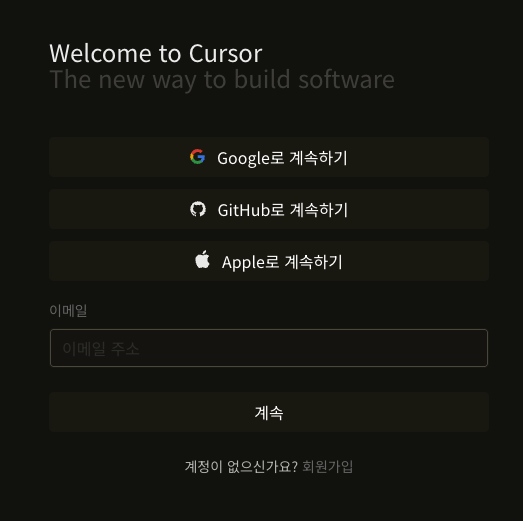
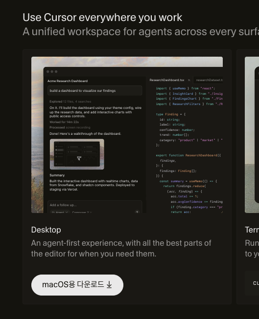
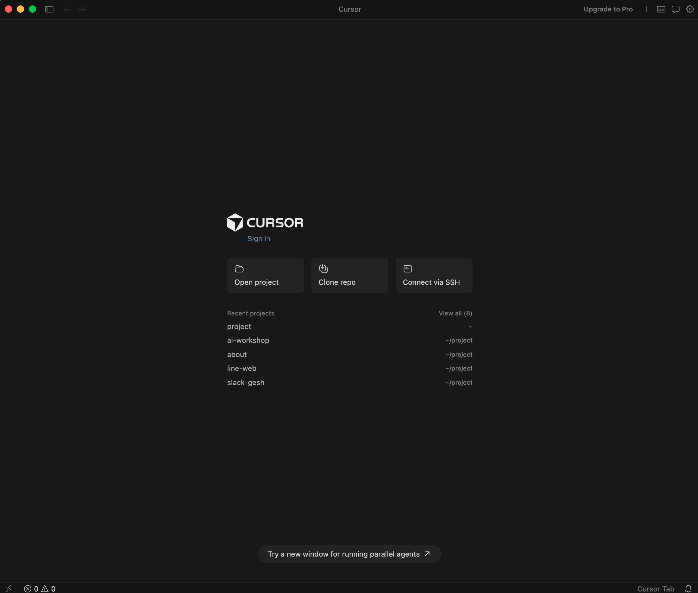

# 1단계: Cursor 가입 및 설치하기

> 이 챕터에서 할 것: Cursor 계정을 만들고, 맥북에 설치한 뒤 처음 실행해봅니다.

---

## 1-1. Cursor란?

Cursor는 AI가 내장된 코드 에디터입니다.  
코드 작성 경험이 없어도 AI에게 원하는 것을 말하면 코드를 만들어 줍니다.

---

## 1-2. 계정 만들기

1. 브라우저에서 [cursor.com](https://cursor.com) 에 접속합니다.
2. 우측 상단 **Sign Up** 버튼을 클릭합니다.
3. Google 계정 또는 이메일로 가입합니다.

> 💡 **이미 GitHub 계정이 있다면?**  
> GitHub으로 로그인해도 됩니다.

---

## 1-3. 다운로드 및 설치

1. 로그인 후 **Download for Mac** 버튼을 클릭합니다.
2. 다운로드된 `.dmg` 파일을 더블클릭합니다.
3. Cursor 아이콘을 **Applications** 폴더로 드래그합니다.

> ⚠️ **"확인되지 않은 개발자" 경고가 뜨면?**  
> - macOS Ventura(13) 이상: 시스템 설정 → 개인 정보 보호 및 보안 → **확인 없이 열기** 클릭  
> - macOS Monterey(12): 시스템 환경설정 → 보안 및 개인 정보 보호 → **확인 없이 열기** 클릭

---

## 1-4. 처음 실행하기

1. Launchpad 또는 Applications 폴더에서 **Cursor**를 실행합니다.
2. 로그인 화면이 뜨면 가입한 계정으로 로그인합니다.
3. 아래와 같은 화면이 보이면 설치 완료입니다. 🎉

---

## FAQ

**Q. 유료인가요?**  
무료 플랜으로 시작할 수 있습니다. 이 가이드는 무료 플랜 기준으로 작성되었습니다.

**Q. 설치 중 오류가 발생해요.**  
macOS 버전을 확인해보세요. macOS 12 이상이 필요합니다.  
시스템 환경설정 → 일반 → 소프트웨어 업데이트에서 확인할 수 있습니다.

---

[← 목차로 돌아가기](README.md)  
다음 단계: [맥 개발환경 세팅하기 →](02.맥-개발환경-세팅.md)
