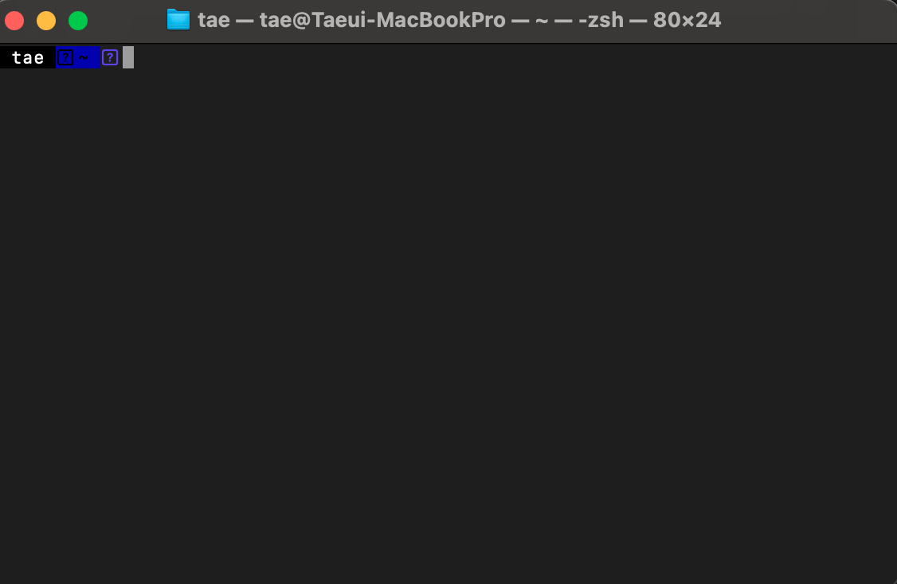
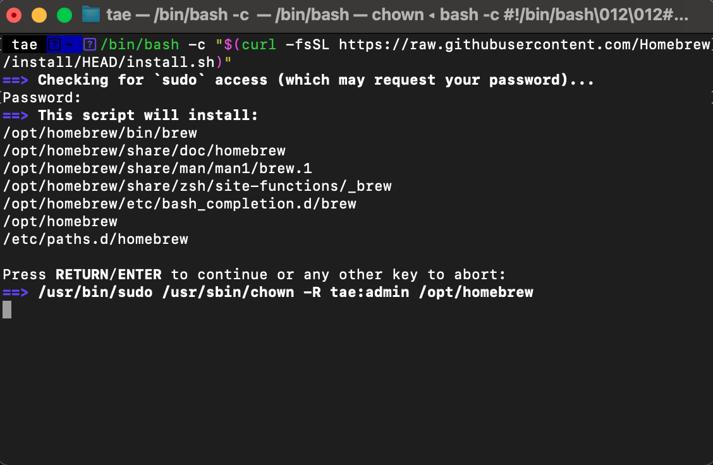
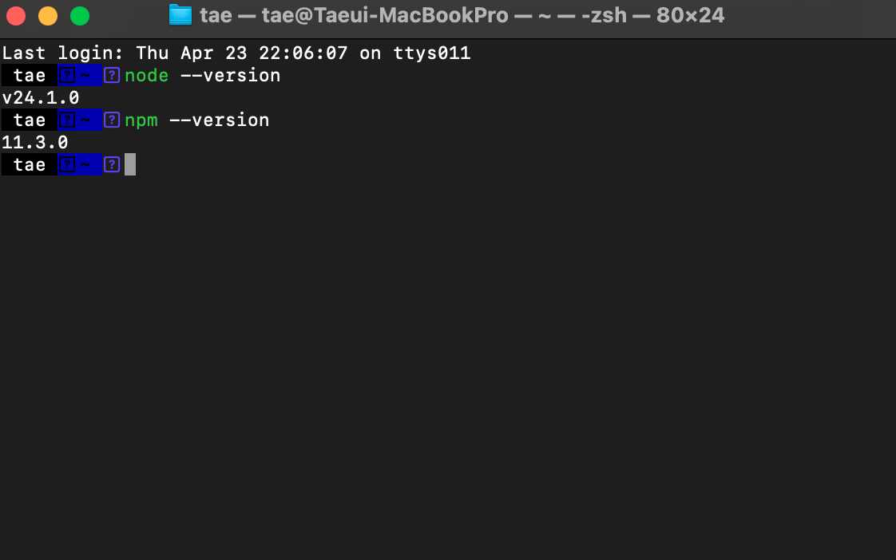

# 2단계: 맥 개발환경 세팅하기

> 이 챕터에서 할 것: 터미널 사용법을 익히고, Homebrew와 Node.js/npm을 설치합니다.

---

## 2-1. 터미널이란?

터미널은 컴퓨터에 명령을 직접 입력하는 도구입니다.  
마우스 클릭 대신 텍스트 명령으로 작업합니다.

**터미널 여는 방법:**
1. 키보드에서 `Command(⌘) + Space`를 눌러 Spotlight를 엽니다.
2. `terminal`을 입력하고 Enter를 누릅니다.



> 💡 **터미널이 무섭게 느껴지나요?**  
> 이 가이드에서 사용하는 명령어는 복사해서 붙여넣으면 됩니다. 직접 외울 필요 없습니다.

---

## 2-2. Homebrew 설치

Homebrew는 맥에서 개발 도구를 쉽게 설치하는 패키지 관리자입니다.

터미널을 열고 아래 명령어를 **복사해서 붙여넣기** 한 뒤 Enter를 누르세요:

```bash
/bin/bash -c "$(curl -fsSL https://raw.githubusercontent.com/Homebrew/install/HEAD/install.sh)"
```

설치 중 맥북 비밀번호를 물어볼 수 있습니다. 입력 시 화면에 표시되지 않지만 정상입니다.



> ⚠️ **Apple Silicon(M1/M2/M3) 맥북 사용자 주의**  
> Apple Silicon 맥북은 Homebrew 설치 경로가 달라서, 터미널이 `brew` 명령어를 찾을 수 있도록 경로를 등록해야 합니다.  
> 아래 명령어를 실행한 뒤, 터미널을 완전히 닫고 다시 여세요:
> ```bash
> echo 'eval "$(/opt/homebrew/bin/brew shellenv)"' >> ~/.zprofile
> eval "$(/opt/homebrew/bin/brew shellenv)"
> ```

설치가 완료되면 아래 명령어로 확인합니다:

```bash
brew --version
```

아래와 비슷한 결과가 나오면 성공입니다:

```
Homebrew 4.x.x
```

---

## 2-3. Node.js 및 npm 설치

Node.js는 JavaScript를 실행하는 환경이고, npm은 패키지 설치 도구입니다.

```bash
brew install node
```

설치 완료 후 버전을 확인합니다:

```bash
node --version
npm --version
```

아래와 비슷한 결과가 나오면 성공입니다:

```
v20.x.x
10.x.x
```



---

## FAQ

**Q. 명령어를 입력했는데 "command not found"가 떠요.**  
Homebrew 설치가 완료되지 않은 것일 수 있습니다. 2-2 단계를 다시 시도해보세요.

**Q. 설치에 너무 오래 걸려요.**  
인터넷 속도에 따라 5~15분 걸릴 수 있습니다. 기다려 주세요.

---

이전 단계: [← Cursor 가입 및 설치하기](01.커서-가입-및-설치.md)  
다음 단계: [첫 번째 프로젝트 만들기 →](03.첫-프로젝트-만들기.md)
