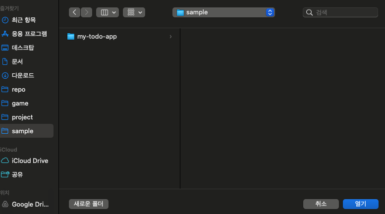
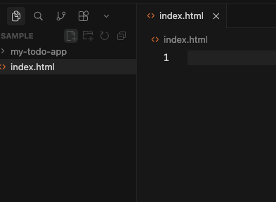

# 3단계: 첫 번째 프로젝트 만들기

> 이 챕터에서 할 것: 프로젝트 폴더를 만들고 Cursor에서 열어봅니다.

---

## 3-1. 프로젝트 폴더 만들기

터미널을 열고 아래 명령어를 실행해 바탕화면에 프로젝트 폴더를 만듭니다:

```bash
mkdir ~/Desktop/my-todo-app
```

> 💡 `mkdir`은 폴더를 만드는 명령어입니다. `~/Desktop`은 바탕화면을 의미합니다.

---

## 3-2. Cursor에서 폴더 열기

1. Cursor를 실행합니다.
2. 상단 메뉴 **File → Open Folder**를 클릭합니다.
3. 바탕화면에서 `my-todo-app` 폴더를 선택하고 **Open**을 클릭합니다.



---

## 3-3. 첫 번째 파일 만들기

Cursor 왼쪽 파일 탐색기에서 **새 파일(+)** 버튼을 클릭합니다.  
파일 이름을 `index.html`로 입력하고 Enter를 누릅니다.



> 💡 `index.html`은 웹 페이지의 시작 파일입니다. 브라우저는 폴더를 열 때 이 파일을 가장 먼저 찾습니다.

---

## 3-4. 파일 구조 이해하기

완성된 프로젝트의 파일 구조는 아래와 같습니다:

```
my-todo-app/
├── index.html    ← 웹 페이지 구조
├── style.css     ← 디자인/색상
└── app.js        ← 기능(버튼 클릭 등)
```

지금은 `index.html`만 있어도 됩니다. 나머지는 다음 챕터에서 AI가 만들어 줍니다.

---

## FAQ

**Q. Cursor에서 폴더가 보이지 않아요.**  
File → Open Folder를 다시 시도하거나, 바탕화면에서 `my-todo-app` 폴더가 있는지 확인해보세요.

---

이전 단계: [← 맥 개발환경 세팅하기](02.맥-개발환경-세팅.md)  
다음 단계: [할 일 목록 앱 만들기 →](04.할일목록-앱-만들기.md)
