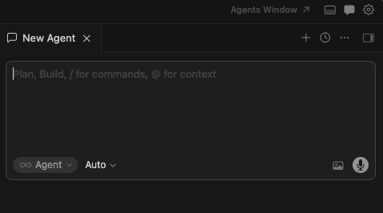
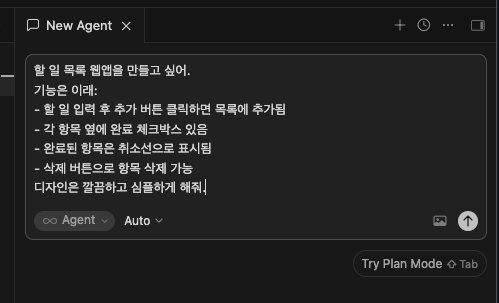
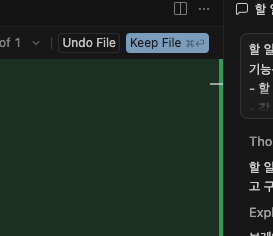

# 4단계: 할 일 목록 앱 만들기

> 이 챕터에서 할 것: Cursor AI에게 원하는 앱을 말로 설명하고, AI가 만들어준 결과를 적용해봅니다.

---

## 4-1. Cursor AI 채팅 열기

Cursor에서 AI와 대화하려면 채팅 패널을 엽니다.

- 단축키: `Command(⌘) + L`
- 또는 우측 상단 채팅 아이콘 클릭



---

## 4-2. AI에게 앱 만들어달라고 요청하기

채팅창에 아래 내용을 **복사해서 붙여넣기** 하고 Enter를 누르세요:

```
할 일 목록 웹앱을 만들고 싶어.
기능은 이래:
- 할 일 입력 후 추가 버튼 클릭하면 목록에 추가됨
- 각 항목 옆에 완료 체크박스 있음
- 완료된 항목은 취소선으로 표시됨
- 삭제 버튼으로 항목 삭제 가능
디자인은 깔끔하고 심플하게 해줘.
```

> 💡 기술적인 내용은 몰라도 됩니다. 원하는 것을 말로 설명하면 AI가 알아서 만들어줍니다.



---

## 4-3. AI가 만든 코드 적용하기

AI가 코드를 생성하면 각 코드 블록 우측 상단의 **Keep File** 버튼을 클릭합니다.  
코드가 여러 개 나와도 각각 Apply를 클릭하면 됩니다.



> 💡 **Apply 버튼이 안 보이면?**  
> 코드 블록 위에 마우스를 올리면 버튼이 나타납니다.
> CMD + S 로도 적용 가능합니다.

Apply를 클릭하면 파일이 자동으로 만들어집니다.  
파일 저장은 `Command(⌘) + S`로 합니다.

---

## 4-4. 궁금한 게 있으면 AI에게 바로 물어보기

코드를 이해하지 않아도 됩니다. AI가 만든 것들이 궁금하면 그냥 물어보면 됩니다.

예시:
```
방금 만든 파일이 각각 어떤 역할을 해?
```

```
이 코드에서 버튼 색깔은 어디서 바꿀 수 있어?
```

> 💡 AI는 코드 선생님이기도 합니다. 모르는 게 있으면 언제든지 물어보세요.

---

## 4-5. AI에게 수정 요청해보기

앱이 마음에 들지 않는 부분이 있으면 AI에게 다시 요청할 수 있습니다.

예시:
```
배경색을 연한 파란색으로 바꿔줘
```

```
완료된 항목의 글자색을 회색으로 바꿔줘
```

---

## FAQ

**Q. AI가 코드를 만들었는데 Apply 버튼이 없어요.**  
코드 블록 위에 마우스 커서를 올려보세요. 또는 코드를 직접 복사해서 해당 파일에 붙여넣기 해도 됩니다.

**Q. 파일이 저장되지 않는 것 같아요.**  
`Command(⌘) + S`로 각 파일을 저장하거나, File → Save All로 한 번에 저장하세요.

---

이전 단계: [← 첫 번째 프로젝트 만들기](03.첫-프로젝트-만들기.md)  
다음 단계: [브라우저에서 확인하기 →](05.브라우저에서-확인하기.md)
